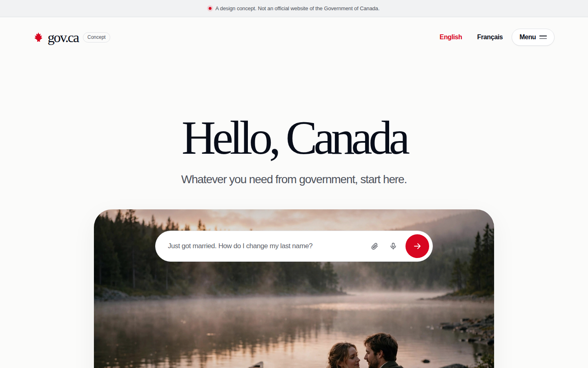

# gov.ca

An unofficial prototype: a conversational front door for Canadian government services, built directly on the **gov.ca Concept** design. Not affiliated with the Government of Canada.



## What it is

This repo starts from the actual gov.ca Concept design (the hero, the maple-leaf lockup, the moment carousel, the chat pill) and wires the pill up to a working agentic chat:

1. Ask a question in the hero pill, or tap a quick chip like Passport or Taxes.
2. You land in a dedicated thread (`#/chat`). The assistant works through your request in the open: a status line morphs through "Working through your request..." to "Searching Canada.ca..." to "Reading official sources..." to "Writing your answer...", with elapsed seconds ticking.
3. Each finished tool round collapses into a one-line trace chip (expandable to show the queries and page titles, never raw JSON).
4. The answer streams in with inline links to the official pages it actually read, an expandable Sources pill, follow-up question pills, and feedback plus copy controls.
5. A Stop button halts generation at any time and keeps what was written so far.

## How it works

There is no server. Everything runs in the browser:

- **Bring your own key.** The first visit to `#/chat` opens an onboarding modal. Paste an OpenAI API key; it is validated against `/v1/models` and stored only in this browser's localStorage. A discreet key icon in the chat header clears the saved key and history at any time. Use a key created just for this prototype, with a spending limit.
- **Agentic tool loop.** The assistant uses the OpenAI Responses API with two tools, `search_canada_ca(query, lang)` and `read_canada_ca_page(url)`, for up to 4 tool rounds, then streams the final answer.
- **Strict URL allowlist.** Only `canada.ca` and `gc.ca` hosts over HTTPS are ever fetched or cited. Anything else is rejected before any network call.
- **Personal-information guard.** A pattern-based guard blocks SIN-like numbers, phone numbers, email addresses, and health-card-like numbers before anything is sent to OpenAI. It is pattern-based, not perfect: never enter personal information.
- **Live retrieval with honest fallback.** Live Canada.ca search is attempted first with short timeouts. When it is blocked (for example by a bot challenge), the assistant falls back to a hand-curated index of 76 official pages (`data/sources.json`). The How-AI-works modal discloses this.
- **Citation honesty.** The system prompt requires citing only pages actually read, and requires the verbatim line "I cannot verify this with the pages I have read." when the sources do not support a claim. AI answers can be wrong: verify on Canada.ca.

Also included: EN/FR toggle (synced with the Concept's own toggle), GPT-6 Luna at Low reasoning effort as the single model (shown in the chat header and under each answer; `#/chat?model=` overrides it for testing), `.txt`/`.md` attachments, voice dictation via Web Speech, session history with New chat, and Privacy and How-AI-works modals.

## Files

- `index.html`: the gov.ca Concept design, intact, plus `<link>`/`<script>` references to the chat layer.
- `chat.css`: thread-view styles in the Concept's visual language (ivory paper, near-black ink, deep Canadian red, serif display).
- `app.js`: chat experience: routing, thread UI, status choreography, modals, streaming.
- `tools.js`: dependency-free agentic toolkit: URL allowlist, PI guard, live search/read with curated fallbacks, the tool loop. Also loads in Node for tests.
- `data/sources.json`: curated index of 76 official Government of Canada pages (EN/FR titles, URLs, summaries).
- `assets/screenshot.png`: hero screenshot of the actual Concept design.

## Run locally

```bash
cd gov-ca
python3 -m http.server 8125
# open http://localhost:8125/ and ask a question
```

Note: `#/chat` is a client-side route; serve `index.html` at the root.

## Tests

```bash
node --check app.js && node --check tools.js
node /tmp/govca-tests3/test.js   # mocked tool loop, allowlist, PI guard, honesty, em-dash scan
```

End-to-end chat requires a real OpenAI key and was verified with a mocked OpenAI API in headless Chromium (tool rounds, trace chips, status morphing, streaming, stop behavior, sources pill, follow-ups). Live OpenAI calls, live Canada.ca retrieval, voice input, and mobile browsers were not verified in this environment.

## Limitations

- Prototype only. Answers are generated and can be plausible but wrong.
- Live Canada.ca search often hits bot challenges from automated clients; the curated index fallback keeps answers grounded but limited to 76 pages.
- Your API key lives in localStorage, readable by page scripts. The site operator sees nothing because there is no backend.

## License

MIT. See `LICENSE`. gov.ca is an unofficial open-source prototype by Richardson Dackam.
